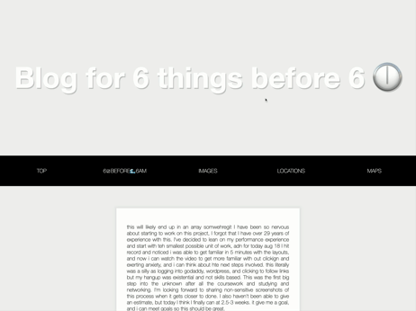

# sixthingsbeforesixam
a localstorage page with js to store a few things to bedone the nextmorning prior to 6am

created as part of wes box 30 days of js course

https://picsvg.com/ used to turn piskel William into svg then changed inline.

created as part of a modification of units learned in 30 days js course by Wes Bos. 

blog added mid August originally the idea was to make a local storage type of blog, but I might use this as my current blog on a future subpage of my next portfolio

## progress as of 8/25 for blog

  